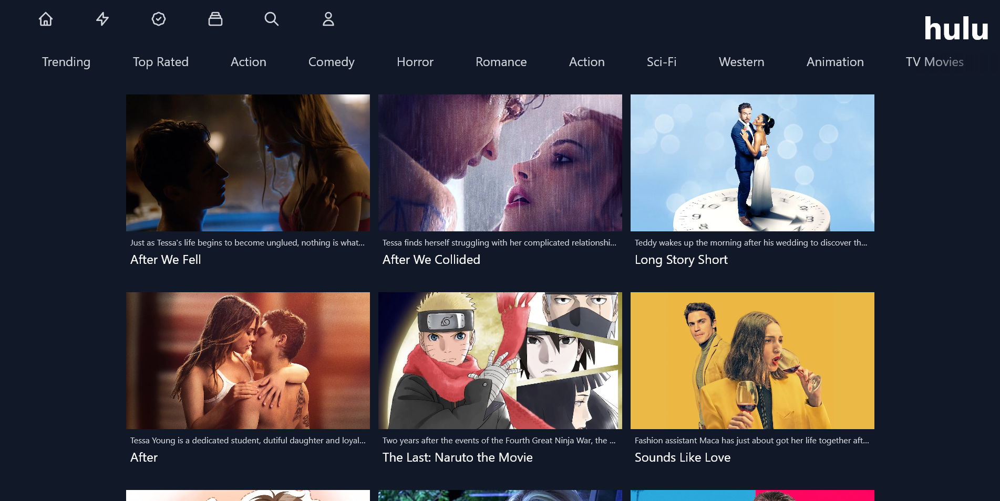

# Hulu Clone with Next.js and Tailwind CSS

## Live Demo

This is the Next.js / Tailwind CSS [Hulu Clone](https://nextjs-hulu-clone-roan.vercel.app) deployed on [Vercel](https://github.com/vercel/next.js/tree/canary/packages/create-next-app).

### Screenshot


## Getting Started

First, run the development server:

```bash
npm run dev
# or
yarn dev
```